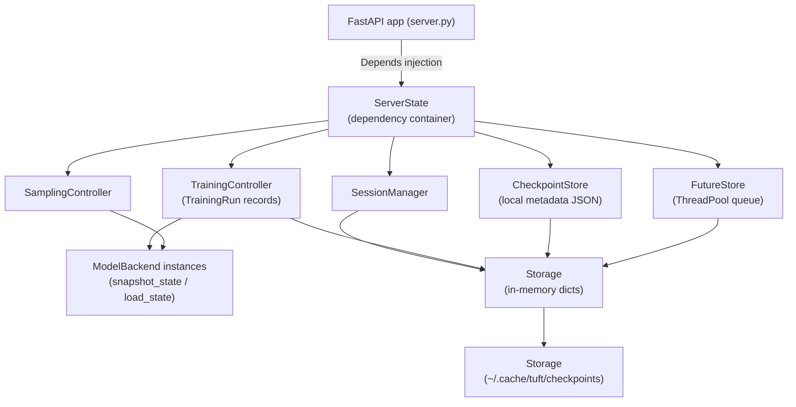

# Minimal TuFT Implementation Design

## 1. Objectives and Constraints
- **Purpose**: expose a local RPC surface that the stock Tinker SDK can call for fine-tuning and sampling workflows without modifying the client.
- **Scope**: cover the API flows demonstrated in README.md. Emphasize correctness and API fidelity over throughput, auth, or multi-tenant scheduling.
- **Out-of-Scope**: hardware-aware placement, multi-node dispatch, distributed training, API key validation, quota enforcement, and packaged base-model downloads.

## 2. External API Contract Summary
All request/response schemas already exist in the vendored Tinker SDK under [tinker/src/tinker/types](../tinker/src/tinker/types),
and the synchronous client behaviors live in [tinker/src/tinker/lib/public_interfaces](../tinker/src/tinker/lib/public_interfaces).
The minimal implementation must back the following resource families:

| Category | Endpoints | Notes |
| --- | --- | --- |
| Session & metadata | `GET /api/v1/healthz`, `GET /api/v1/get_server_capabilities`, `POST /api/v1/create_session`, `POST /api/v1/session_heartbeat`, `POST /api/v1/create_sampling_session` | Heartbeat interval is 10s (see [tinker/src/tinker/lib/internal_client_holder.py](../tinker/src/tinker/lib/internal_client_holder.py)). Responses can be in-memory; only IDs and info strings are required. |
| Model lifecycle | `POST /api/v1/create_model`, `POST /api/v1/get_info`, `POST /api/v1/unload_model` | Mirrors the flows in [tinker/src/tinker/lib/public_interfaces/service_client.py](../tinker/src/tinker/lib/public_interfaces/service_client.py); creating a model currently means instantiating a LoRA adapter on top of a base HF checkpoint. |
| Training primitives | `POST /api/v1/forward`, `POST /api/v1/forward_backward`, `POST /api/v1/optim_step` | Matches [tinker/src/tinker/lib/public_interfaces/training_client.py](../tinker/src/tinker/lib/public_interfaces/training_client.py). Each call returns an `UntypedAPIFuture` that is later resolved by `retrieve_future`. |
| Sampling | `POST /api/v1/asample` | Triggered through sampling sessions and the implementation in [tinker/src/tinker/lib/public_interfaces/sampling_client.py](../tinker/src/tinker/lib/public_interfaces/sampling_client.py). |
| Futures | `POST /api/v1/retrieve_future` | Required by `_APIFuture.result_async` defined in [tinker/src/tinker/lib/api_future_impl.py](../tinker/src/tinker/lib/api_future_impl.py). |
| Weights & checkpoints | `POST /api/v1/save_weights`, `POST /api/v1/load_weights`, `POST /api/v1/save_weights_for_sampler`, `GET /api/v1/training_runs/{id}/checkpoints`, `DELETE /api/v1/training_runs/{id}/checkpoints/{ckpt}` | Needs a `weights_info` helper for `ServiceClient.create_training_client_from_state`; reference [tinker/src/tinker/lib/public_interfaces/rest_client.py](../tinker/src/tinker/lib/public_interfaces/rest_client.py). |
| REST listings | `GET /api/v1/training_runs`, `POST /api/v1/weights_info`, `GET /api/v1/training_runs/{id}`, `GET /api/v1/training_runs/{id}/checkpoints/{ckpt}/archive` (can initially return 501) | Enables CLI inspection flows driven by the same rest client file. |

## 3. High-Level Architecture

### 3.1 FastAPI Application Layer
- Exposes the Stainless-compatible `/api/v1/...` surface through FastAPI so the stock Tinker SDK can talk to this server without any client changes.
- Uses dependency injection to hand each handler the shared `ServerState`, keeping the HTTP layer focused on validation and response marshaling while the controllers do the real work.
- The CLI command (`tuft start`) is a thin wrapper that builds an `AppConfig`, spins up the FastAPI app, and therefore belongs to the same box in the diagram as the request routers.

### 3.2 ServerState Container
- Acts as the dependency hub shown in the diagram: one instance is created at startup and holds references to every controller and store.
- Provides façade methods (`run_forward`, `create_model`, `save_checkpoint`, etc.) so HTTP handlers call a single object while `ServerState` fans out to the right component.
- Coordinates cross-cutting actions such as unloading a model (which touches both training and sampling controllers) or ensuring checkpoint directories exist before any request runs.

### 3.3 SessionManager (Sessions Node)
- Maintains a lightweight in-memory catalog of session IDs, metadata, and heartbeat timestamps that back every session-related endpoint.
- Other controllers consult it to verify that a client owns a valid session before allowing model creation, sampling sessions, or checkpoint operations.
- The data never leaves memory, matching the diagram arrow from the session node into the shared storage block.

### 3.4 TrainingController & ModelBackend
- TrainingController tracks each fine-tuning run (metadata, locks, checkpoint counters, last activity) and is responsible for routing training traffic into the compute backend.
- Every record wraps a `ModelBackend`, the deterministic toy model that knows how to run forward/backward passes, apply optimizer updates, sample tokens, and serialize state for checkpoints.
- Sequence guards on the controller keep SDK-issued `seq_id`s in order so concurrent requests cannot corrupt a model, which is why this component sits between the FastAPI layer, the FutureStore queue, and the backend instances in the diagram.

### 3.5 FutureStore (ThreadPool Queue)
- Provides the asynchronous queue shown beside the controllers: work is submitted to a thread pool, and the HTTP layer immediately returns a `request_id`.
- Tracks the lifecycle of each request (pending, ready with payload, or failed) so the SDK can poll `retrieve_future` and surface progress to users.
- Emits `TryAgainResponse` objects while jobs are running, which is how the platform communicates queue state without blocking requests.

### 3.6 SamplingController
- Owns the sampling node from the diagram by mapping session IDs to either trained models or cached base backends and by remembering the last sequence number served to each client.
- Validates sequencing, records a short prompt history for observability, and then calls into the same `ModelBackend` pool for token generation, ensuring sampling respects the same state as training.
- Shares `ServerState`’s dependency on SessionManager (to verify the caller) and on CheckpointStore/TrainingController when sessions are created from saved weights.

### 3.7 CheckpointStore & Shared Storage
- Bridges in-memory metadata with on-disk JSON blobs under the configured checkpoint directory, which is the filesystem node in the diagram.
- TrainingController keeps pointers to each `CheckpointRecord`, enabling REST listings and load/save operations to reuse the same metadata without re-reading every file.
- Exposes helper views (`list_user_checkpoints`, `build_archive_url`, `get_weights_info`) so the CLI and SDK can inspect checkpoints using the canonical `tinker.types` schemas.

## 4. Request Lifecycle Walkthrough
This walkthrough traces the major flows from the perspective of Section 3’s components.

1. **Session bootstrap**
  - The SDK calls `create_session`; FastAPI routes the request to `ServerState.create_session`, which delegates to `SessionManager` for UUID allocation and heartbeat tracking.
  - Every subsequent call that mutates state first confirms the session exists; a missing or expired session short-circuits before touching any controller.

2. **Model creation**
  - With a valid session, the client invokes `create_model`. `ServerState` verifies the session again, then asks `TrainingController` to allocate a new `TrainingRunRecord` plus a fresh `ModelBackend`.
  - The response returns a `model_id`, which becomes the handle for all later training, checkpointing, and sampling operations.

3. **Sequenced training calls**
  - Requests such as `forward`, `forward_backward`, and `optim_step` carry a monotonically increasing `seq_id`. FastAPI immediately enqueues the work inside `FutureStore`, giving the client a `request_id` to poll.
  - When the worker thread executes the call, `TrainingController`’s `_with_sequence_guard` validates that the provided `seq_id` matches the next expected value for that model. Out-of-order calls trigger a `sequence_conflict` error before any backend work happens.
  - Successful calls hand the data to the model’s `ModelBackend`, collect metrics, and mark the future as ready. The client polls `retrieve_future` until the payload is available.

4. **Checkpointing and session-aware sampling**
  - `save_weights` and `save_weights_for_sampler` flow from FastAPI → `ServerState.save_checkpoint` → `CheckpointStore`, which serializes the backend state to disk and updates the in-memory checkpoint catalog tied to the owning session.
  - To generate text, the SDK either references a saved checkpoint or calls `create_sampling_session`. `SamplingController` verifies the originating session, enforces its own monotonic `seq_id` per sampler, then reuses the appropriate `ModelBackend` to serve `asample` requests.

5. **Introspection and cleanup**
  - REST listings (`list_training_runs`, `list_checkpoints`, `weights_info`) reuse the same metadata caches populated earlier, so they respect session ownership and checkpoint visibility without re-scanning the filesystem.
  - When `unload_model` runs, `ServerState` coordinates `TrainingController` and `SamplingController` to tear down the run, evict related sampling sessions, and free backend resources, ensuring subsequent requests cannot reuse stale IDs.

## 5. Testing Strategy Without Real LLMs
### 5.1 Fake Backend Abstraction
- Introduce a `ModelBackend` interface with methods `forward`, `backward`, `optim_step`, `generate`, `snapshot`, `load_snapshot`.
- Implement a single **ToyBackend** that maintains numpy embeddings, per-token logits, and loss metrics; gradients flow through a manual backward pass and an Adam optimizer (with running moments) so training behavior resembles the real service.
- The ToyBackend serializes its complete state (weights + optimizer buffers + RNG seed) into checkpoint metadata so `load_checkpoint` restores deterministic behavior during integration tests.
- Dependency injection keeps the surface swappable so future backends can slot in without rewriting controllers, even though only ToyBackend ships in the minimal design.

### 5.2 Unit Tests
- **FutureStore tests**: verify lifecycle (pending → ready → retrieval), try-again behavior, and error propagation.
- **SessionManager tests**: ensure heartbeats update timestamps and expired sessions are logged.
- **CheckpointStore tests**: confirm URI formatting and metadata retrieval for `weights_info`.
- **Controllers**: mock the backend to assert conversions between `ModelInput`/`TensorData` and backend tensors.

### 5.3 Integration Tests
- Spin up the FastAPI app with ToyBackend and use the real Tinker Python SDK (vendored) as the client:
  1. `create_lora_training_client` → `forward_backward` → `optim_step` → `save_weights` → `create_sampling_client` → `sample`.
  2. `ServiceClient.create_training_client_from_state` using the saved checkpoints to ensure `weights_info` + `load_state` interop.
- Because ToyBackend runs instantly, the tests complete quickly without downloading any checkpoints.

### 5.4 Contract Tests
- Serialize representative responses for each endpoint and compare them against the Pydantic models from `tinker.types`. FastAPI already uses the same models, but dedicated tests help detect drift against the concrete classes in [tinker/src/tinker/types](../tinker/src/tinker/types).
- Validate that every endpoint path defined under [tinker/src/tinker/resources](../tinker/src/tinker/resources) has a live handler (e.g., reflection-based test).

### 5.5 Tooling
- Use `pytest` + `httpx.AsyncClient` for server tests.
- Provide fixtures for ToyBackend, temporary checkpoint directories, and fake session/model IDs.

## 6. Future Enhancements (Post-MVP)
- Replace in-memory stores with Redis/sqlite for persistence.
- Implement real rate limiting and queue-state reporting to leverage Tinker’s backpressure UX.
- Add structured telemetry export to match `TelemetryProvider` expectations in the SDK as well as for service monintoring.
- Add a more realistic backend (e.g., HF/accelerated) that can replace ToyBackend when hardware and real checkpoints are available.
